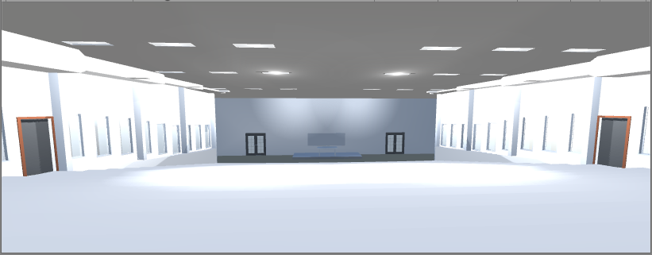
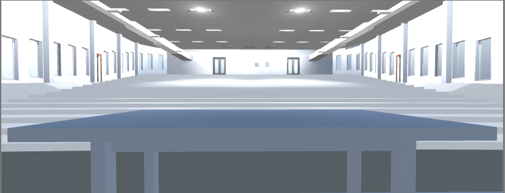
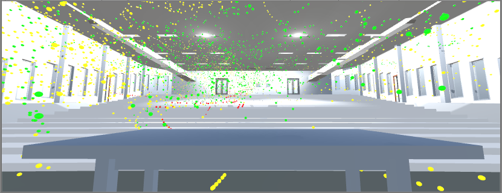

# TLT VR
## Design and Simulation of Air-conditioning System in a Large Auditorium

Tools Used - Unity, GoogleVR, Autodesk Revit

### Overview
The aim of this project is to:
1. Create a 3D model of a lecture theatre,
2. Design an air-conditioning system for the theatre,
3. Simulate the indoor air distribution, and
4. Visualise the setup in a virtual environment.

The virtual environment gives users access to experience 3D in a vivid and immersive way.

TLT Front

---

TLT Back

---

TLT Plot
